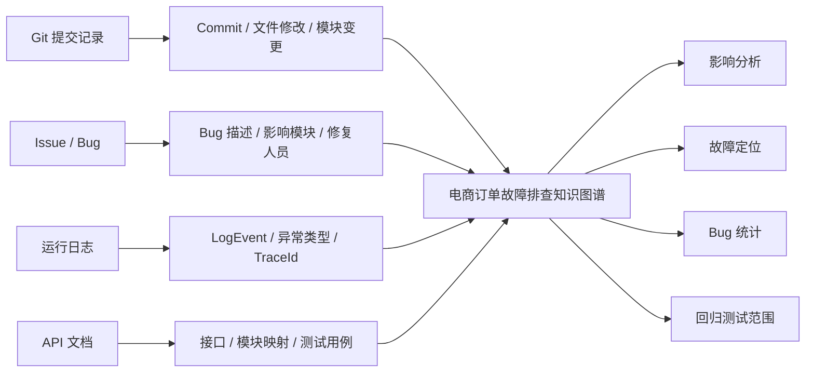
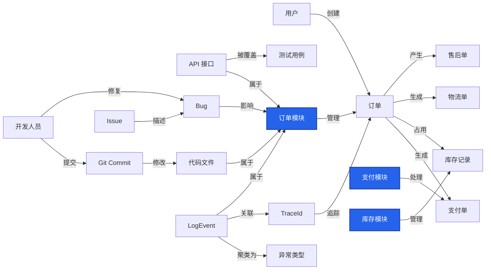
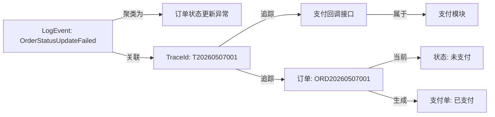
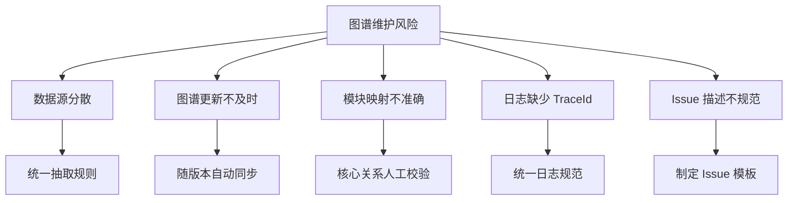

<!-- ===== Page 1: Cover ===== -->

# 电商订单故障排查知识图谱

12 小组

---
layout: default
background: false
---

<!-- ===== Page 2: 项目背景与痛点 ===== -->

<h2 class="text-3xl font-bold text-slate-800 mb-1">项目背景：电商订单排障为什么困难？</h2>

订单故障往往跨越业务链路、系统模块和维护数据，单靠日志或经验很难快速定位。

  
电商系统复杂性

  

    

      <b class="text-slate-800">链路长</b>
      
下单、支付、库存、物流、售后连续协作。

    

    

      <b class="text-slate-800">模块多</b>
      
订单模块与支付、库存、优惠等模块强耦合。

    

    

      <b class="text-slate-800">数据散</b>
      
Git、Issue、日志、API 文档分散存放。

    

    

      <b class="text-slate-800">变更多</b>
      
接口、代码文件和日志格式随版本持续变化。

    

  

  
→

  
→

  
→

  
→

  
对应痛点与图谱作用

  

    

      <b class="text-slate-800">链路长 → 影响范围难判断</b>
      
图谱把订单、支付单、库存记录、物流单和售后单串成业务路径。

    

    

      <b class="text-slate-800">模块多 → 故障边界难定位</b>
      
通过“模块—接口—日志—订单”关系定位跨模块同步问题。

    

    

      <b class="text-slate-800">数据散 → 排查信息来回切换</b>
      
将 Commit、Bug、LogEvent、TraceId、API 和测试用例放入同一张图。

    

    

      <b class="text-slate-800">变更多 → 回归测试容易遗漏</b>
      
根据“文件—模块—接口—测试”路径推导变更后的回归范围。

    

  

---
layout: default
background: false
---

<!-- ===== Page 3: 方案分层概览 ===== -->

<h2 class="text-3xl font-bold text-slate-800 mb-1">方案分层概览</h2>

从实体建模到关系抽取，再到故障排查应用，形成完整的图谱方案

  

    
实体层

    

      覆盖订单、支付、库存、物流、售后等业务对象，以及 Commit、Bug、LogEvent、TraceId、API 接口和测试用例。
    

    
解决“图谱中有哪些节点”的问题

  

  

    
关系层

    

      将代码变更、故障描述、日志异常、接口文档和测试用例连接为可追踪路径。
    

    
解决“节点之间如何关联”的问题

  

  

    
应用层

    

      支持影响分析、异常反查、Bug 统计、人员定位和回归测试范围判断。
    

    
解决“图谱如何服务排障”的问题

  

  这三层对应后续页面：实体分类、关系抽取、核心图谱结构和查询路径。

---
layout: default
background: false
---

<!-- ===== Page 2: 多源数据汇入全景 ===== -->

<h2 class="text-3xl font-bold text-slate-800 mb-1">多源数据汇入知识图谱</h2>

Git · Issue · 日志 · API 文档 —— 四种数据源融合为统一故障排查视图

  
<b class="text-slate-700">Git</b> 追踪提交、文件与模块影响

  
<b class="text-slate-700">Issue</b> 抽取 Bug 描述与修复信息

  
<b class="text-slate-700">日志</b> 通过 TraceId 连接异常与订单

  
<b class="text-slate-700">API</b> 建立接口、模块和测试映射

  统一查询入口：围绕一个模块、订单、Bug 或 Commit，快速追踪相关业务、代码、日志和测试范围。

---
layout: default
background: false
---

<!-- ===== Page 3: 实体分类卡片 ===== -->

<h2 class="text-3xl font-bold text-slate-800 mb-1">实体分类设计</h2>

5 大类 · 20+ 实体 · 覆盖业务链路与维护链路

  

    
📦

    

      
业务实体

      
8 个

    

  

  

    {{ e }}
  

  

    
⚙️

    

      
系统模块

      
6 个

    

  

  

    {{ e }}
  

  

    
📝

    

      
代码变更

      
4 个

    

  

  

    {{ e }}
  

  

    
🔴

    

      
故障日志

      
5 个

    

  

  

    {{ e }}
  

  

    
👤

    

      
人员维护

      
3 个

    

  

  

    {{ e }}
  

  

 业务实体

  

 维护实体

  
设计重点：业务对象负责描述故障发生位置，维护对象负责解释故障来源与修复过程。

---
layout: default
background: false
---

<!-- ===== Page 5: 数据源关系卡片 ===== -->

<h2 class="text-3xl font-bold text-slate-800 mb-1">数据源关系抽取总览</h2>

4 类数据源 → 16 条关系 → 汇入知识图谱

  

    
G

    Git 提交记录
    4 条
  

  

    
<b class="text-slate-700">Commit</b>—— 修改 ——<b class="text-slate-700">代码文件</b>

    
<b class="text-slate-700">代码文件</b>—— 属于 ——<b class="text-slate-700">系统模块</b>

    
<b class="text-slate-700">Commit</b>—— 影响 ——<b class="text-slate-700">系统模块</b>

    
<b class="text-slate-700">开发人员</b>—— 提交 ——<b class="text-slate-700">Commit</b>

  

  

    
I

    Issue / Bug
    5 条
  

  

    
<b class="text-slate-700">Issue</b>—— 描述 ——<b class="text-slate-700">Bug</b>

    
<b class="text-slate-700">Bug</b>—— 影响 ——<b class="text-slate-700">系统模块</b>

    
<b class="text-slate-700">Bug</b>—— 关联 ——<b class="text-slate-700">API 接口</b>

    
<b class="text-slate-700">修复人员</b>—— 修复 ——<b class="text-slate-700">Bug</b>

    
<b class="text-slate-700">Bug</b>—— 关联 ——<b class="text-slate-700">Commit</b>

  

  

    
L

    运行日志
    4 条
  

  

    
<b class="text-slate-700">LogEvent</b>—— 属于 ——<b class="text-slate-700">系统模块</b>

    
<b class="text-slate-700">LogEvent</b>—— 聚类为 ——<b class="text-slate-700">异常类型</b>

    
<b class="text-slate-700">LogEvent</b>—— 关联 ——<b class="text-slate-700">TraceId</b>

    
<b class="text-slate-700">TraceId</b>—— 追踪 ——<b class="text-slate-700">订单</b>

  

  

    
A

    API 文档
    3 条
  

  

    
<b class="text-slate-700">API 接口</b>—— 属于 ——<b class="text-slate-700">系统模块</b>

    
<b class="text-slate-700">API 接口</b>—— 操作 ——<b class="text-slate-700">业务实体</b>

    
<b class="text-slate-700">API 接口</b>—— 被测试 ——<b class="text-slate-700">测试用例</b>

  

  抽取原则：每条边都来自 Git、Issue、日志或 API 文档中的结构化证据，避免凭经验手动画关系。

---
layout: default
background: false
---

<!-- ===== Page 6: 数据源关系详细图 ===== -->

<h2 class="text-3xl font-bold text-slate-800 mb-1">数据源关系抽取详图</h2>

Git · Issue · 日志 · API —— 四类数据源的结构化关系

  

    

      
Git 数据源

      
代码变更

    

    
从提交记录抽取文件修改、模块归属和提交人员。

  

  

    
开发人员

    
→

    
Commit

    
代码文件

  

  
关键边：提交、修改、属于、影响

  

    

      
Issue / Bug 数据源

      
故障描述

    

    
从问题单中抽取 Bug、影响模块、修复人员和关联接口。

  

  

    
Issue

    
→

    
Bug

    
系统模块

  

  
关键边：描述、影响、关联、修复

  

    

      
运行日志数据源

      
线上异常

    

    
从 LogEvent 聚类异常类型，并通过 TraceId 追踪订单。

  

  

    
LogEvent

    
→

    
TraceId

    
订单

  

  
关键边：聚类为、关联、追踪、属于

  

    

      
API 文档数据源

      
接口测试

    

    
从接口文档建立接口、模块、业务实体和测试用例映射。

  

  

    
API 接口

    
→

    
系统模块

    
测试用例

  

  
关键边：属于、操作、被覆盖

  汇入规则：四类数据源虽然格式不同，但最终都落到 <b class="text-slate-800">系统模块、业务实体、测试用例</b> 三类核心节点上，形成统一排障路径。

---
layout: default
background: false
---

<!-- ===== Page 7: 核心知识图谱结构（PNG） ===== -->

<h2 class="text-3xl font-bold text-slate-800 mb-1">核心知识图谱结构</h2>

  

  业务维度
  代码维度
  问题维度
  日志维度
  测试维度

---
layout: default
background: false
---

<!-- ===== Page 8: 订单模块核心图谱 Mermaid ===== -->

<h2 class="text-3xl font-bold text-slate-800 mb-1">模块知识图谱</h2>
<!-- 
业务链路 · 接口 · 代码 · Bug · 日志 —— 五维一体
 -->

  
<b class="text-slate-700">右侧业务链路</b>：用户下单后关联支付单、库存记录、物流单和售后单。

  
<b class="text-slate-700">左侧维护链路</b>：Commit、代码文件、Issue、Bug、LogEvent 和测试用例解释故障来源。

---
layout: default
background: false
---

<!-- ===== Page 9: 查询路径 Q1 ===== -->

<h2 class="text-3xl font-bold text-slate-800 mb-1">查询路径：模块变更 → 影响哪些测试？</h2>

变更影响分析 · 回归测试范围选择

  

    

      
Step 1

      
Git Commit

      
变更入口

    

    
→

    

      
Step 2

      
代码文件

      
定位文件

    

    
→

    

      
Step 3

      
订单模块

      
映射模块

    

    
→

    

      
Step 4

      
API 接口

      
关联接口

    

    
→

    

      
Step 5

      
测试用例

      
输出范围

    

  

  
返回测试范围

  

    
订单创建测试

    
支付回调测试

    
库存锁定测试

    
订单取消测试

  

  
排查价值

  

    当订单服务代码发生变更时，图谱根据“文件—模块—接口—测试”的路径自动推导回归测试范围，减少凭经验选测试导致的遗漏。
  

---
layout: default
background: false
---

<!-- ===== Page 10: 查询路径 Q2 ===== -->

<h2 class="text-3xl font-bold text-slate-800 mb-1">查询路径：异常日志 → 订单与模块定位</h2>

从日志反查业务影响 · 快速定位故障范围

  
查询路径

  

    <b class="text-slate-700">LogEvent</b> → <b class="text-slate-700">TraceId</b> → <b class="text-slate-700">订单</b> → <b class="text-slate-700">系统模块</b>
  

  
实例数据

  

    
LogEvent <code class="text-slate-700 bg-white/80 px-1 rounded">OrderStatusUpdateFailed</code>

    
TraceId <code class="text-slate-700 bg-slate-50 px-1 rounded">T20260507001</code>

    
订单 <code class="text-slate-700 bg-white/80 px-1 rounded">ORD20260507001</code>

    
涉及 <b class="text-slate-700">订单模块 / 支付模块</b>

  

  🎯 发现订单状态为"未支付"但支付单已支付，定位到支付回调接口异常

  定位结论：故障范围集中在支付回调接口，以及订单模块与支付模块之间的状态同步链路。

---
layout: default
background: false
---

<!-- ===== Page 11: 补充查询 ===== -->

<h2 class="text-3xl font-bold text-slate-800 mb-1">补充查询：统计与人员定位</h2>

在单次故障定位之外，图谱还可以支持模块风险统计和人员经验沉淀

  

    
查询三

    
最近 30 天 Bug 最多的模块？

    

      
输入条件

      
Bug 时间范围 = 最近 30 天

      
图谱路径

      
Issue → Bug → 影响模块 → 分组统计

      
统计口径

      
按系统模块聚合 Bug 数量并排序

    

  

  

    
示例返回

    

      
订单模块<b>18 个</b>

      
支付模块<b>11 个</b>

      
库存模块<b>8 个</b>

    

  

  

    价值：识别高风险模块，为重点排查、代码审查和测试资源分配提供依据。
  

  

    
查询四

    
谁修复过支付相关 Bug 最多？

    

      
输入条件

      
影响模块 = 支付模块

      
图谱路径

      
Bug → 影响模块 → 修复人员 → 分组统计

      
统计口径

      
按修复人员聚合支付相关 Bug 数量

    

  

  

    
示例返回

    

      
张同学<b>9 个</b>

      
李同学<b>6 个</b>

      
王同学<b>4 个</b>

    

  

  

    价值：快速找到熟悉支付问题的人，辅助 Bug 分派、故障协同和经验复用。
  

  这类查询体现图谱的统计能力：不仅能定位单个故障，也能沉淀模块风险和人员经验。

---
layout: default
background: false
---

<!-- ===== Page 11: 风险与对策 ===== -->

<h2 class="text-3xl font-bold text-slate-800 mb-1">图谱维护：风险与对策</h2>

如果图谱不随版本更新，一周内就会失效

  
<b>数据源分散</b> 统一抽取规则

  
<b>更新不及时</b> 版本自动同步

  
<b>映射不准确</b> 核心关系校验

  
<b>日志缺标识</b> 强制 TraceId

  
<b>Issue 不规范</b> 制定模板

---
layout: default
background: false
---

<!-- ===== Page 12: 维护机制与闭环 ===== -->

<h2 class="text-3xl font-bold text-slate-800 mb-1">维护机制与闭环</h2>

图谱随版本持续演进，而非一次性交付

  

    
1

    

      
Git 提交触发更新

      
每次 Commit 后根据修改文件更新"文件—模块"关系

    

  

  

    
2

    

      
Issue 关闭时同步 Bug 关系

      
Bug 修复后记录修复人员、影响模块和关联 Commit

    

  

  

    
3

    

      
日志定期聚类更新异常

      
定期分析 LogEvent 将相似异常归类到同一异常类型

    

  

  

    
4

    

      
API 文档随版本同步

      
接口变更后同步更新"接口—模块—测试"关系

    

  

  

  本方案构建的是一个<strong class="text-slate-600">可维护</strong>的故障排查知识图谱，随系统版本持续更新

---
layout: center
background: false
---

<!-- ===== Page 13: Summary ===== -->

<h2 class="text-4xl font-bold text-slate-800 mb-4">总结</h2>

  
核心价值

  
帮助开发和维护人员更快回答：哪个模块出了问题？这次变更影响什么？应该找谁修、测哪些内容？

谢谢大家

Powered by Slidev

