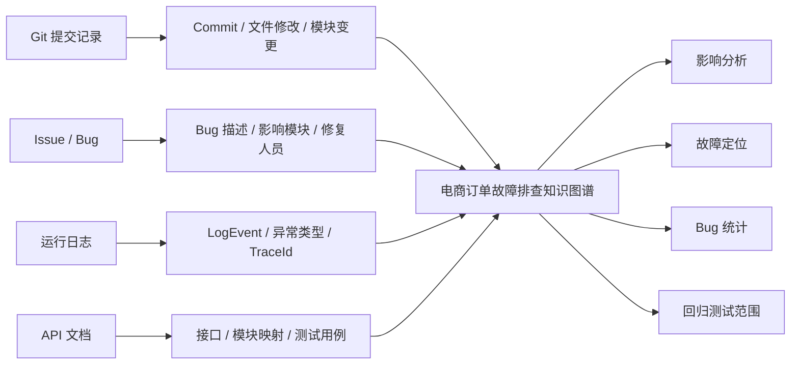
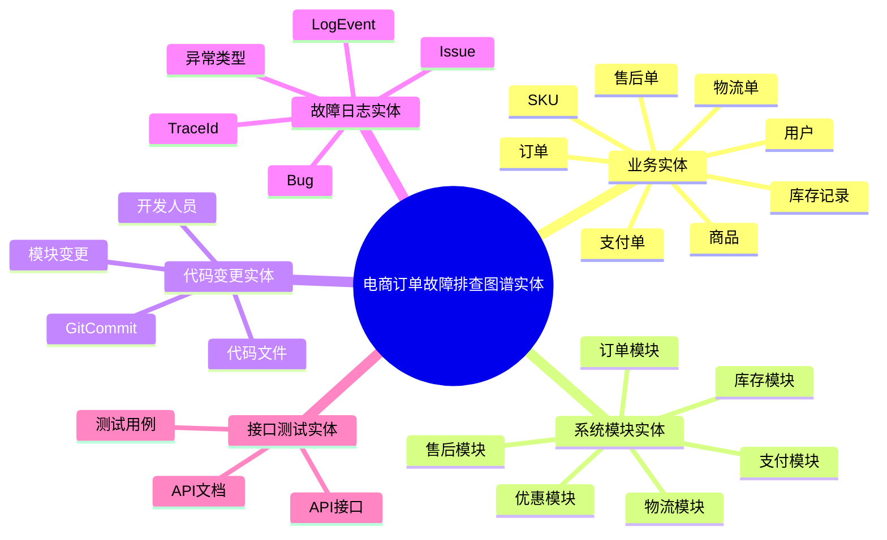
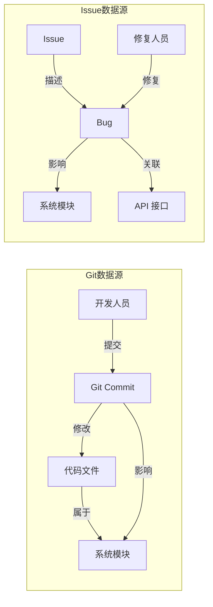
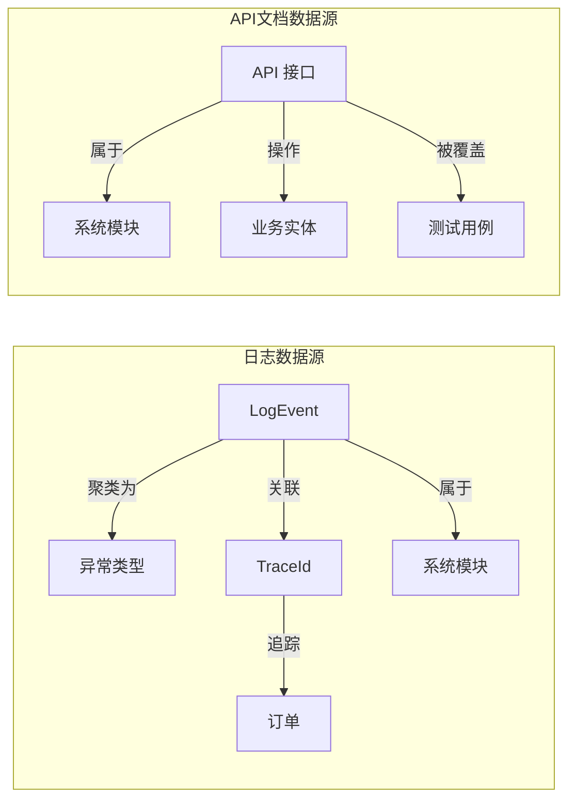
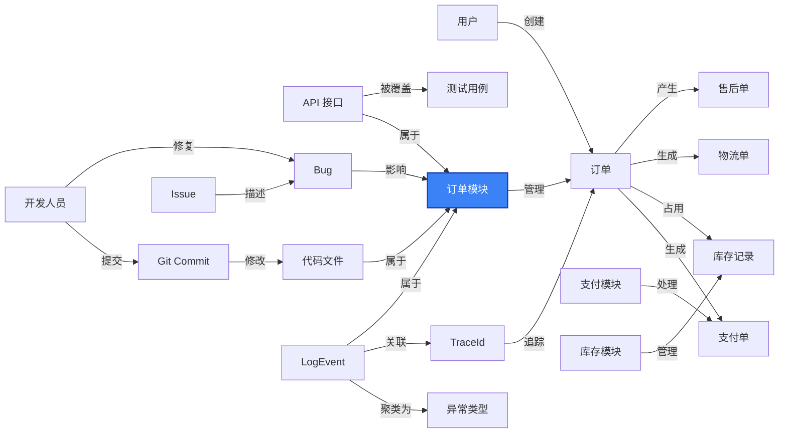
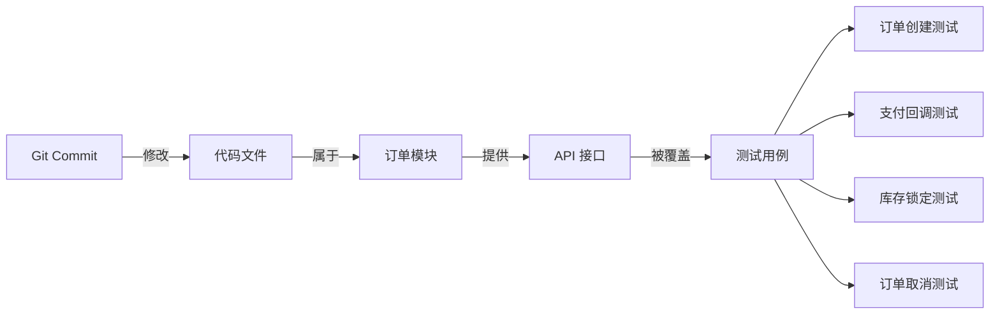
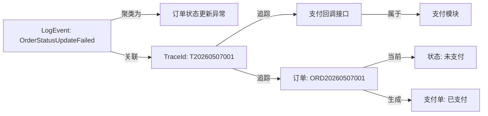
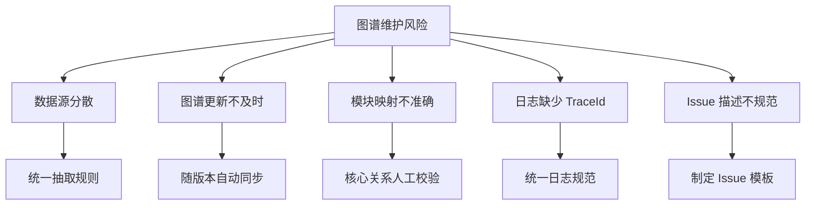

<!-- ===== Page 1: Cover ===== -->

Knowledge Graph for E-Commerce Troubleshooting

# 电商订单故障排查知识图谱

多源数据融合 · 故障定位 · 影响分析

  

    Git
    提交记录
  

  
→

  

    Issue
    Bug 追踪
  

  
→

  

    日志
    运行日志
  

  
→

  

    API文档
    接口规范
  

  故障排查知识图谱

  影响分析
  故障定位
  Bug 统计
  回归测试

---
layout: default
background: false
---

<!-- ===== Page 2: 多源数据汇入全景 ===== -->

<h2 class="text-3xl font-bold text-slate-800 mb-1">多源数据汇入知识图谱</h2>

Git · Issue · 日志 · API 文档 —— 四种数据源融合为统一故障排查视图

---
layout: default
background: false
---

<!-- ===== Page 3: 实体分类卡片 ===== -->

<h2 class="text-3xl font-bold text-slate-800 mb-1">实体分类设计</h2>

5 大类 · 20+ 实体 · 覆盖业务链路与维护链路

  

    
📦

    

      
业务实体

      
8 个

    

  

  

    {{ e }}
  

  

    
⚙️

    

      
系统模块

      
6 个

    

  

  

    {{ e }}
  

  

    
📝

    

      
代码变更

      
4 个

    

  

  

    {{ e }}
  

  

    
🔴

    

      
故障日志

      
5 个

    

  

  

    {{ e }}
  

  

    
👤

    

      
人员维护

      
3 个

    

  

  

    {{ e }}
  

  

 业务实体

  

 维护实体

---
layout: default
background: false
---

<!-- ===== Page 4: 实体思维导图 ===== -->

<h2 class="text-3xl font-bold text-slate-800 mb-1">实体全景视图</h2>
<!-- 
五大类别 · 层次化展示
 -->

---
layout: default
background: false
---

<!-- ===== Page 5: 数据源关系卡片 ===== -->

<h2 class="text-3xl font-bold text-slate-800 mb-1">数据源关系抽取总览</h2>

4 类数据源 → 16 条关系 → 汇入知识图谱

  

    
G

    Git 提交记录
    4 条
  

  

    
<b class="text-orange-700">Commit</b>—— 修改 ——<b class="text-orange-700">代码文件</b>

    
<b class="text-orange-700">代码文件</b>—— 属于 ——<b class="text-orange-700">系统模块</b>

    
<b class="text-orange-700">Commit</b>—— 影响 ——<b class="text-orange-700">系统模块</b>

    
<b class="text-orange-700">开发人员</b>—— 提交 ——<b class="text-orange-700">Commit</b>

  

  

    
I

    Issue / Bug
    5 条
  

  

    
<b class="text-red-700">Issue</b>—— 描述 ——<b class="text-red-700">Bug</b>

    
<b class="text-red-700">Bug</b>—— 影响 ——<b class="text-red-700">系统模块</b>

    
<b class="text-red-700">Bug</b>—— 关联 ——<b class="text-red-700">API 接口</b>

    
<b class="text-red-700">修复人员</b>—— 修复 ——<b class="text-red-700">Bug</b>

    
<b class="text-red-700">Bug</b>—— 关联 ——<b class="text-red-700">Commit</b>

  

  

    
L

    运行日志
    4 条
  

  

    
<b class="text-yellow-700">LogEvent</b>—— 属于 ——<b class="text-yellow-700">系统模块</b>

    
<b class="text-yellow-700">LogEvent</b>—— 聚类为 ——<b class="text-yellow-700">异常类型</b>

    
<b class="text-yellow-700">LogEvent</b>—— 关联 ——<b class="text-yellow-700">TraceId</b>

    
<b class="text-yellow-700">TraceId</b>—— 追踪 ——<b class="text-yellow-700">订单</b>

  

  

    
A

    API 文档
    3 条
  

  

    
<b class="text-green-700">API 接口</b>—— 属于 ——<b class="text-green-700">系统模块</b>

    
<b class="text-green-700">API 接口</b>—— 操作 ——<b class="text-green-700">业务实体</b>

    
<b class="text-green-700">API 接口</b>—— 被测试 ——<b class="text-green-700">测试用例</b>

  

---
layout: default
background: false
---

<!-- ===== Page 6: 数据源关系详细图 ===== -->

<h2 class="text-3xl font-bold text-slate-800 mb-1">数据源关系抽取详图</h2>

Git · Issue · 日志 · API —— 四类数据源的结构化关系

---
layout: default
background: false
---

<!-- ===== Page 7: 核心知识图谱结构（PNG） ===== -->

<h2 class="text-3xl font-bold text-slate-800 mb-1">核心知识图谱结构</h2>

以订单模块为中心，串联五维关联

  

---
layout: default
background: false
---

<!-- ===== Page 8: 订单模块核心图谱 Mermaid ===== -->

<h2 class="text-3xl font-bold text-slate-800 mb-1">订单模块知识图谱</h2>
<!-- 
业务链路 · 接口 · 代码 · Bug · 日志 —— 五维一体
 -->

---
layout: default
background: false
---

<!-- ===== Page 9: 查询路径 Q1 ===== -->

<h2 class="text-3xl font-bold text-slate-800 mb-1">查询路径：模块变更 → 影响哪些测试？</h2>

变更影响分析 · 回归测试范围选择

  
查询路径

  

    <b class="text-blue-700">Commit</b> → <b class="text-blue-700">文件</b> → <b class="text-blue-700">订单模块</b> → <b class="text-blue-700">API 接口</b> → <b class="text-blue-700">测试用例</b>
  

  
返回结果

  

    订单创建测试
    支付回调测试
    库存锁定测试
    订单取消测试
  

  🎯 帮助确定回归测试范围，减少遗漏

---
layout: default
background: false
---

<!-- ===== Page 10: 查询路径 Q2 ===== -->

<h2 class="text-3xl font-bold text-slate-800 mb-1">查询路径：异常日志 → 订单与模块定位</h2>

从日志反查业务影响 · 快速定位故障范围

  
查询路径

  

    <b class="text-red-700">LogEvent</b> → <b class="text-red-700">TraceId</b> → <b class="text-red-700">订单</b> → <b class="text-red-700">系统模块</b>
  

  
实例数据

  

    
LogEvent <code class="text-red-700 bg-red-50 px-1 rounded">OrderStatusUpdateFailed</code>

    
TraceId <code class="text-slate-700 bg-slate-50 px-1 rounded">T20260507001</code>

    
订单 <code class="text-blue-700 bg-blue-50 px-1 rounded">ORD20260507001</code>

    
涉及 <b class="text-violet-700">订单模块 / 支付模块</b>

  

  🎯 发现订单状态为"未支付"但支付单已支付，定位到支付回调接口异常

---
layout: default
background: false
---

<!-- ===== Page 11: 风险与对策 ===== -->

<h2 class="text-3xl font-bold text-slate-800 mb-1">图谱维护：风险与对策</h2>

如果图谱不随版本更新，一周内就会失效

---
layout: default
background: false
---

<!-- ===== Page 12: 维护机制与闭环 ===== -->

<h2 class="text-3xl font-bold text-slate-800 mb-1">维护机制与闭环</h2>

图谱随版本持续演进，而非一次性交付

  

    
1

    

      
Git 提交触发更新

      
每次 Commit 后根据修改文件更新"文件—模块"关系

    

  

  

    
2

    

      
Issue 关闭时同步 Bug 关系

      
Bug 修复后记录修复人员、影响模块和关联 Commit

    

  

  

    
3

    

      
日志定期聚类更新异常

      
定期分析 LogEvent 将相似异常归类到同一异常类型

    

  

  

    
4

    

      
API 文档随版本同步

      
接口变更后同步更新"接口—模块—测试"关系

    

  

  

  本方案构建的是一个<strong class="text-slate-600">可维护</strong>的故障排查知识图谱，随系统版本持续更新

